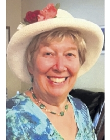

This website is a celebration of the life of Sheila Scott.

# About Sheila

Beloved and proud mother of Julian Duncan (Jennifer) and Anne Duncan Rastogi (Ravi). Cherished Nana of Kayla, Heather and Ethan Duncan and Simon and Maya Rastogi. Beloved sister of Clive Scott (Elisabeth) and Keith Scott (Elizabeth) and loving aunt of Christopher Scott (Lorna), Clive Scott (Mo) and Ashley Gardiner (Luke). 

Born September 6, 1946 in Falkirk, Scotland, Sheila had a loving childhood and recalled memorable family holidays. She studied French and German, graduating from Strathclyde University with Distinction in Languages. She moved to Canada after her marriage to Ron Duncan in 1969. Much of her career was as Program Coordinator in Continuing Studies at UWO. 

Our Dancing Queen Mum, was a qualified and gifted dance teacher, both locally and internationally while travelling the world. She loved her Stony Lake cottage, enjoying swimming and canoeing and tea on the dock. She rarely missed an opportunity to attend theatre, concerts and loved exploring nature while hiking and cross-country skiing. 

Sheila passed peacefully at her home, surrounded by family, on May 23, 2023. 

# Discover more

[Obituary](./obituary)

[Photos](./photos)

[Tributes](./tributes)
